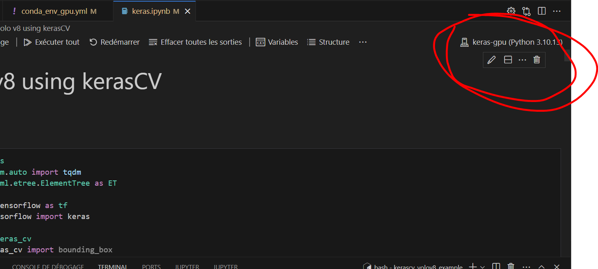

# Example object detection with YOLOv8 and KerasCV

This example is base on [this page](https://colab.research.google.com/github/keras-team/keras-io/blob/master/examples/vision/ipynb/yolov8.ipynb#scrollTo=2hlzYHXQ3R2a)

### Configure conda env
Clone the repository then create the conda env file

```bash
conda env create -n keras-gpu --file conda_env_gpu.yml
conda activate keras-gpu

# Install keras-cv lib
pip install --upgrade git+https://github.com/keras-team/keras-cv -q
```

### Run the Jupyter notebook
Using vscode with python and jupyter extension select the python version of the keras-gpu conda env.

